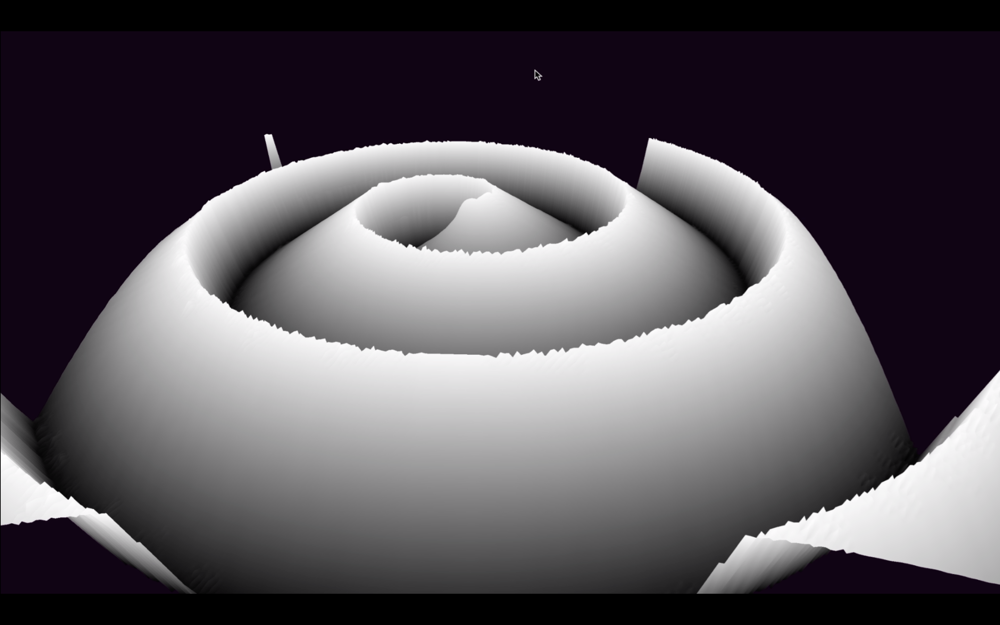

# **USC CSCI 420: Computer Graphics - taught by Dr. Jernej Barbič**  

## **Programming Assignment 1: Height Fields Using Shaders**  

    Operating System: macOS 10.15
    Source Code Editor: Sublime Text, Version 3.2.2, Build 3211

### **HOW TO EXECUTE THE CODE (For macOS):**
1. Go to folder ```hw1-starterCode```
2. Compile using the command: ```make```.  
Note: To delete all the object files and executables:```make clean```

2. To run\:  
    - Either type\: 
    ```
    ./<your-exe-filename> <heightfield-filename>
    ``` 
    - Or type: 
    ```
    ./<your-exe-filename> <heightfield-filename> <overlayColorImage-filename>
    ```
    Sample:  
    ```
    ./hw1 heightmap/terrain-256.jpg  
    ./hw1 heightmap/SantaMonicaMountains-768.jpg heightmap/SantaMonicaMountainsColor-768.jpg  
    ./hw1 heightmap/spiral.jpg
    ```

### **FUNCTIONALITY OF EXECUTABLE:**
After running the program, a heightfield generated from the input image, rendered using points, is shown (as display option is initially set to point mode). Thereafter:  
- Typing '1' renders heightmap using POINTS.  
- Typing '2' renders heightmap using LINES/WIREFRAME.  
- Typing '3' renders heightmap using TRIANGLES.  
- Typing '4' renders heightmap using SMOOTHENING on vertices of the TRIANGLES. (This mode uses vertex shader for calculating smoothened height and output color).  
- Typing '5' renders WIREFRAME on top of TRIANGLES. (EXTRA CREDIT).  
- Dragging mouse with the left mouse button clicked produces rotation about the x and y axes.  
- Dragging mouse with the middle mouse button clicked produces rotation about the z-axis.
- Holding SHIFT and dragging the mouse with the left mouse button clicked produces scaling on the x and y axes.
- Holding SHIFT and dragging the mouse with the middle mouse button clicked produces scaling on the z-axis.
- Holding 't' and dragging the mouse with the left mouse button clicked produces translation along the x and y axes. (CTRL is not working on macOS Catalina 10.15.3 so used 't' for translate)
- Holding 't' and dragging the mouse with the middle mouse button clicked produces translation along the z-axis. (CTRL is not working on macOS Catalina 10.15.3 so used 't' for translate)
- Typing 'x' takes a single screenshot of the current state of the window running the application.
- Toggling 'r' turns continuous rotation of the heightmap(centered at the world origin) about the y-axis, on and off. (EXTRA CREDIT)
- Typing 'a' animates the heightmap, rotating AND/OR scaling AND/OR translating it, while also showing the different modes applied. (EXTRA CREDIT)
- Typing 's' takes 300 screenshots showing the whole animation sequence described above.
- Typing 'ESC' exits the application.

### **ADDITIONAL FEATURES(EXTRA CREDIT CONSIDERATIONS):**

1. The code can generate height from the grayscale heightfield file while getting color for the vertices based on color values taken from another image of equal size. You can check this by executing:  
```./hw1 heightmap/Heightmap.jpg heightmap/HeightmapColor.jpg``` 
However, the code can still support the height-based coloring as per the core requirements. You can check this by executing:  
```./hw1 heightmap/spiral.jpg```

2. The code can also support color in input images. It can detect if the image is colored or grayscaled, and render accordingly. You can check this by executing:  
```./hw1 heightmap/circle.jpg```

3. Typing '5' renders WIREFRAME on top of TRIANGLES.

4. Typing 'a' animates the heightmap, rotating AND/OR scaling AND/OR translating it, while also showing the different modes applied. (You can check code for this in the idleFunc().)

5. Toggling 'r' turns continuous rotation of the heightmap(centered at the world origin) about the y-axis, on and off.

6. For aesthetic considerations,
   -  I have coded the scaling factor of height of the heightmap and camera LookAt such that it can adjust height and view depending on the resolution of the input image. The code can handle images of very high resolution. I have tried images as high as 2048 × 2048. You can check this by executing: 
 ```./hw1 heightmap/dots.jpg```
   - The code can handle images with varying width and height.
   - I have centered the heightmap at the world origin so that the rotation and scaling happens about it's center.

### **NECESSARY FILES AND FOLDERS LOCATIONS:**

- Inside the ```hw1-starterCode``` folder, all the **images** used (color, grayscale, overlay) are stored in the ```heightmap``` folder.

### **EXHIBIT:**
  
  
  
[](https://www.youtube.com/watch?v=GQ5UOkTdmEU)